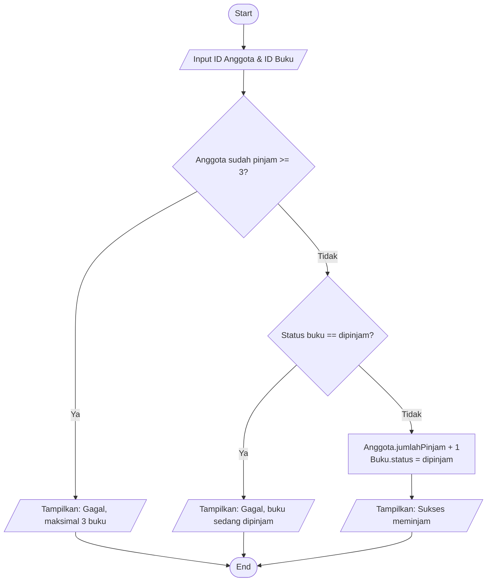

# Day2-DasarMobileAplikasi

* ** Raka Erlangga ** 11224160083

---

## Bagian A — Dokumen Analisis

### 1. Problem Statement
Program sistem perpustakaan menerima data berupa ID anggota dan ID buku untuk memproses peminjaman, serta menerima jumlah hari keterlambatan saat proses pengembalian buku. Aturan perpustakaan menetapkan batas maksimal peminjaman adalah 3 buku untuk setiap anggota.

Jika buku yang ingin dipinjam sedang dalam status dipinjam oleh orang lain, maka buku tersebut tidak bisa dipinjam. 

Selain itu, jika pelanggan mengembalikan buku melewati batas waktu, maka akan dikenakan denda sebesar **Rp1.000** per hari keterlambatan. Program kemudian memproses data tersebut dan menampilkan status keberhasilan transaksi beserta total denda jika ada.

### 2. Actor
Actor yang menggunakan sistem adalah **Petugas Perpustakaan**.

Petugas perpustakaan memberikan atau memasukkan:
* ID Anggota.
* ID Buku.
* Jumlah hari terlambat (saat pengembalian).

Setelah data diproses, program menampilkan pesan status transaksi dan total denda.

### 3. Input & Output

**Input**

| Data | Tipe | Contoh |
| :--- | :--- | :--- |
| ID Anggota | `String` | `'A01'` |
| ID Buku | `String` | `'B01'` |
| Hari Telat | `int` | `2` |

Hari keterlambatan menggunakan satuan **hari**.
Status buku menggunakan `enum`:

```dart
enum Status {
  tersedia,
  dipinjam,
}
```

**Output**
Setelah data diproses, program akan menampilkan output berupa `String` yang berisi pesan sukses atau gagal, serta nominal denda jika ada.
Contoh: `"Sukses meminjam buku"` atau `"Sukses kembali. Denda: Rp2000"`.

### 4. Functional Requirement
* **FR-01:** Sistem dapat memproses transaksi peminjaman buku.
* **FR-02:** Sistem dapat memproses transaksi pengembalian buku.
* **FR-03:** Sistem dapat menampilkan pesan error jika peminjaman melanggar aturan.
* **FR-04:** Sistem dapat menghitung denda keterlambatan saat pengembalian.

### 5. Business Rules
* **BR-01:** Maksimal pinjam 3 buku untuk setiap anggota.
* **BR-02:** Buku yang sedang dipinjam tidak bisa dipinjam oleh anggota lain.
* **BR-03:** Denda dikenakan sebesar Rp1.000 per hari keterlambatan.

### 6. Decomposition
* `cariBuku(String id)`: Mencari data buku berdasarkan ID.
* `cariAnggota(String id)`: Mencari data anggota berdasarkan ID.
* `hitungDenda(int telatHari)`: Menghitung nominal denda dikali Rp1.000 (BR-03).
* `prosesPinjam(String idAnggota, String idBuku)`: Memvalidasi syarat (BR-01 & BR-02) lalu mencatat peminjaman.
* `prosesKembali(String idAnggota, String idBuku, int telatHari)`: Memulihkan status buku dan menghitung denda.

### 7. Pattern Recognition
**Filter / Guard Clause**: Pengecekan aturan peminjaman dilakukan di awal fungsi (validasi). Jika ada aturan yang dilanggar (anggota sudah pinjam 3 buku, atau buku sedang dipinjam), program akan langsung mengembalikan pesan `Gagal` (early return) dan proses berhenti sebelum mengubah data.

### 8. Abstraction
* **Enum:** `Status { tersedia, dipinjam }`
* **Class `Buku`:** Memiliki atribut `id` (String) dan `status` (Status).
* **Class `Anggota`:** Memiliki atribut `id` (String) dan `jumlahPinjam` (int).

### 9. Algorithm
**Langkah-langkah Peminjaman:**
1. Program menerima input ID Anggota dan ID Buku.
2. Program mencari data anggota dan buku tersebut.
3. Cek apakah angka `jumlahPinjam` pada anggota >= 3 (BR-01). Jika ya, tampilkan pesan gagal dan proses berhenti.
4. Cek apakah `status` buku saat ini adalah "dipinjam" (BR-02). Jika ya, tampilkan pesan gagal dan proses berhenti.
5. Jika semua syarat aman, tambahkan angka `jumlahPinjam` anggota sebanyak 1.
6. Ubah `status` buku menjadi "dipinjam".
7. Tampilkan pesan sukses.

### 10. Flowchart untuk Proses Utama (Peminjaman)



### 11. Pseudocode

```text
PROCEDURE prosesPinjam(idAnggota, idBuku)
  anggota = cariAnggota(idAnggota)
  buku = cariBuku(idBuku)
  
  IF anggota.jumlahPinjam >= 3 THEN
    RETURN "Gagal: Maksimal pinjam 3 buku"
  END IF
  
  IF buku.status == dipinjam THEN
    RETURN "Gagal: Buku sedang dipinjam"
  END IF
  
  anggota.jumlahPinjam = anggota.jumlahPinjam + 1
  buku.status = dipinjam
  
  RETURN "Sukses meminjam buku"
END PROCEDURE
```

---

## Bagian C — Tabel Traceability

| Business Rule | Function | Diuji pada skenario |
| :--- | :--- | :--- |
| **BR-01** Maksimal pinjam 3 buku | `prosesPinjam`, `cariAnggota` | **Test 3** (Anggota A02 yang jumlah pinjamnya sudah 3 mencoba meminjam lagi) |
| **BR-02** Buku dipinjam tidak bisa dipinjam | `prosesPinjam`, `cariBuku` | **Test 2** (Anggota A01 meminjam buku B02 yang statusnya sedang dipinjam) |
| **BR-03** Denda Rp.1000 per hari keterlambatan | `hitungDenda`, `prosesKembali` | **Test 5** (Anggota A01 mengembalikan buku dengan input terlambat 2 hari) |
